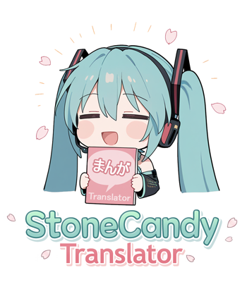
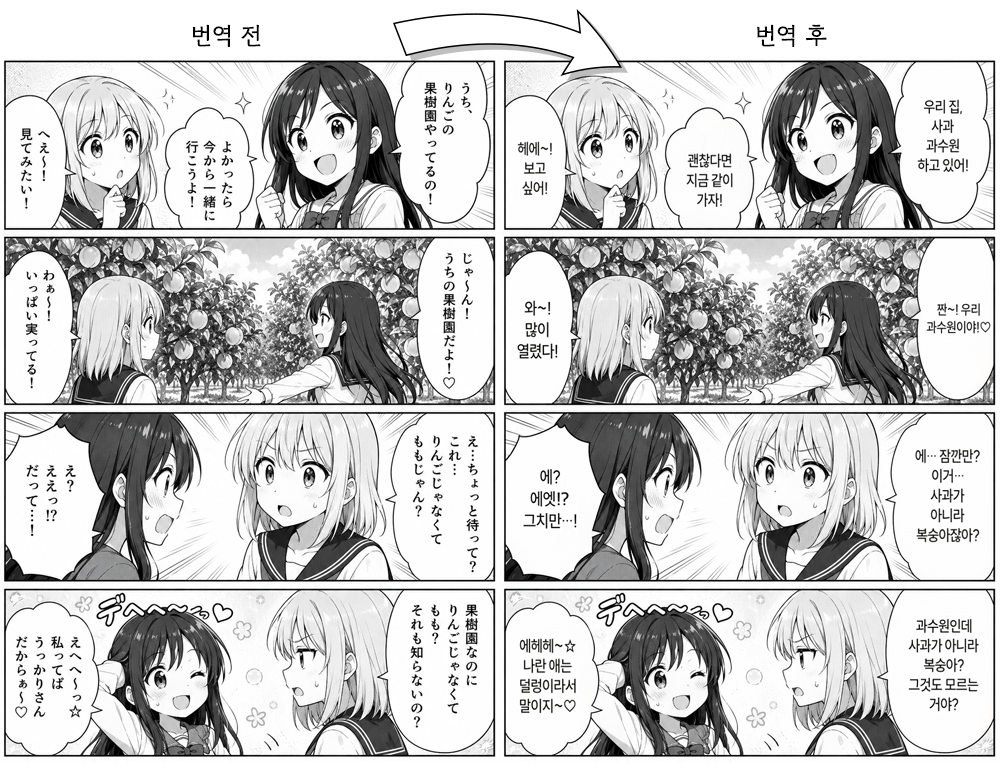
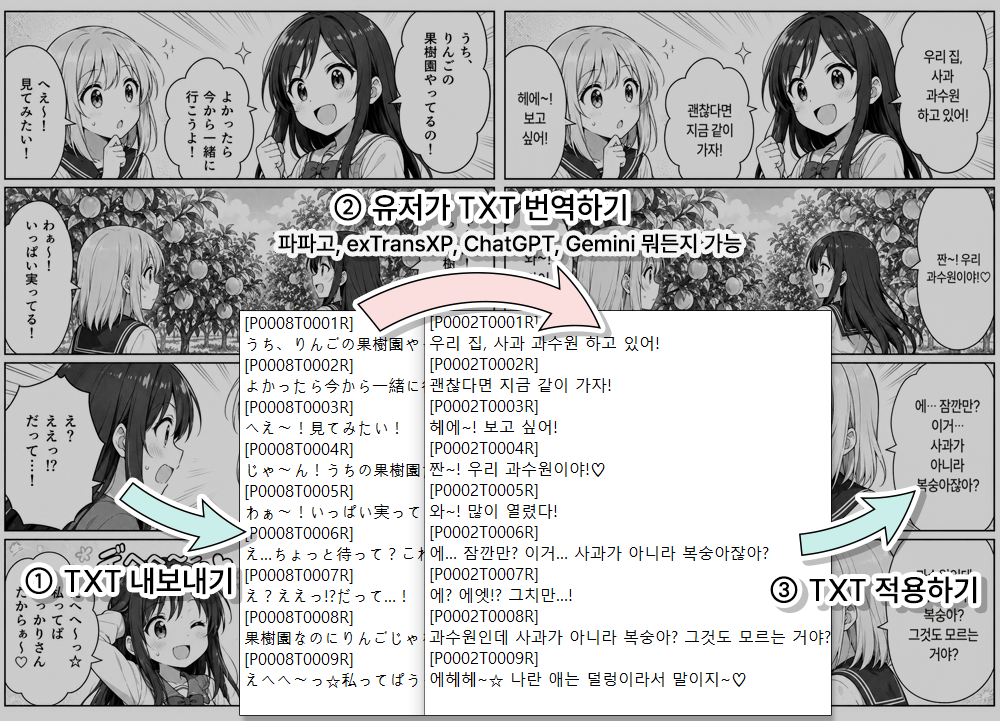
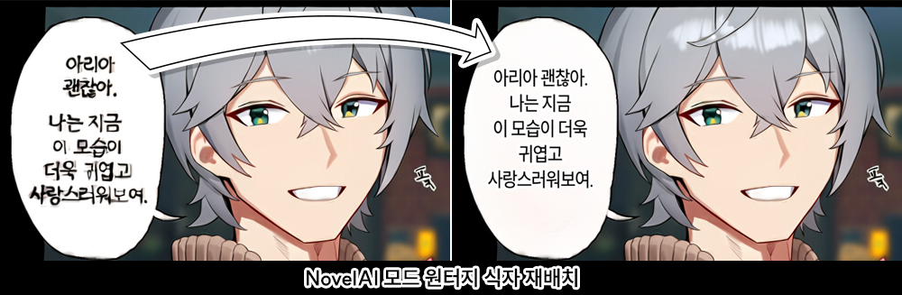
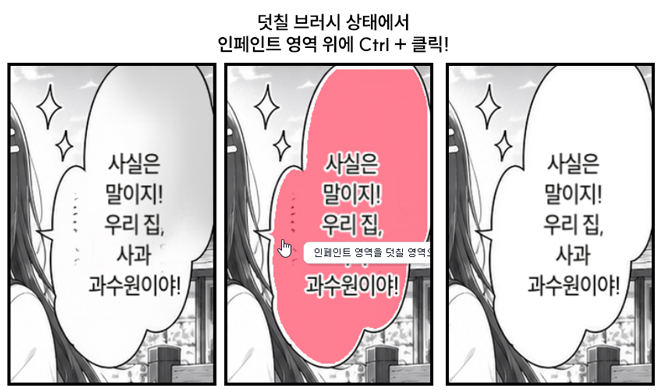

속도와, 편의성, 접근성을 모두 극대화하고자 조정된 만화 번역기입니다. 가장 큰 장벽인 API 없이도 번역을 진행할 수 있는 TXT 모드가 마련되어 있고, 한글 배치에 최적화된 알고리즘을 제공하며, 클릭 몇 번으로 출판급 퀄리티에 가까운 결과물을 낼 수 있도록 UI가 마련되어 있습니다. 또한 여러 가지 편의기능이 마련되어 있습니다. 

 <H3>StoneCandy</H3>

 
  
소스코드가 아직 정리되지 않았습니다. 반드시 Release 버전을 이용해 주세요

**[StoneCandy-Translator 0.8 Release](https://github.com/Stone-Candy/StoneCandy-Translator/releases)**
 
 

---

## 🖼️ Showcase

 
 

<strong>▲ 위의 그림은 TXT모드 사용 예시이며, 번역 API 사용시 편집 전까지 전 과정 자동으로 진행됩니다.</strong>

 
 
 

## 📝 번역기 사용팁
1. 메인에서 상단 제목을 눌러 모드를 고르고, 파일이나 폴더를 드래그 앤 드랍하고, 시작 버튼을 누르면 진행됩니다.
2. 압축 파일도 지원되지만, 여러 파일을 지속적으로 작업할 때는 폴더 상태로 불러오는 것을 권장합니다.
3. 처음 시작 시에는 모델을 자동으로 다운로드하기 때문에, 진행 속도가 느릴 수 있습니다.
4. 편집 화면에서 z키를 누르면, 빠르게 원본과 비교하며 작업할 수 있습니다.
5. 클리닝(대패질) 작업은 인페인트로 이루어지기 때문에, 대체로 퀄리티가 괜찮지만, 인페인트는 기본적으로 주변의 색상과 무늬를 닮으려는 경향이 있어서, 가끔 말풍선 내부로 원치 않는 색상이나 무늬가 침범해 들어올 때가 있습니다. 그럴 때는 덧칠 지우개 상태로, ctrl + 클릭하게 되면 단색으로 깔끔하게 정리할 수 있습니다.

 

